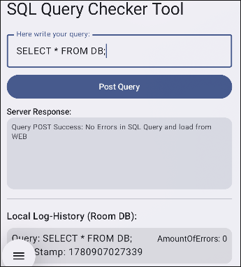
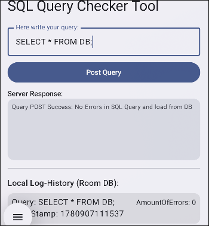
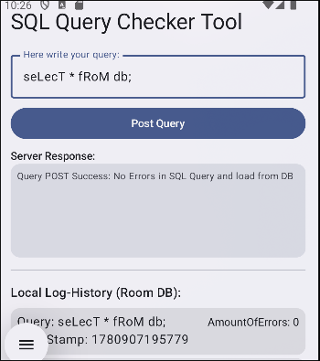
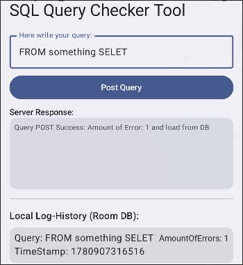
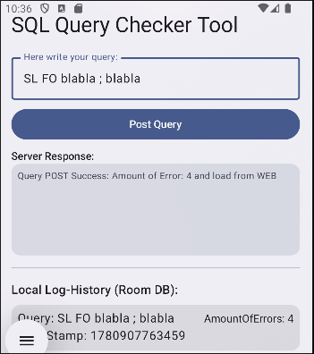
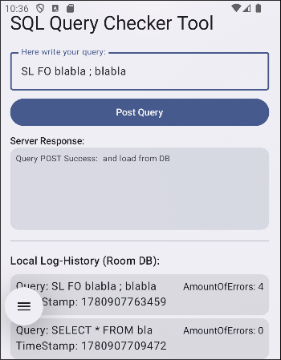

# Documentation

## First Succeed Test should return "from WEB"
Tested: `SELECT * FROM DB;`

## Second Test with same Query should return "from DB"
Tested: `SELECT * FROM DB;`

## Third Test with same Query but different casing return "from DB"
Tested: `seLecT * fRoM db;`

## Fourth Test with errors in query
Tested: `FROM something SELET`

## Fith Test with more than 1 error
Tested: `SL FO blabla ; bla`

## Sixth Test with more than 1 error again
Tested: `SL FO blabla ; blabla`

